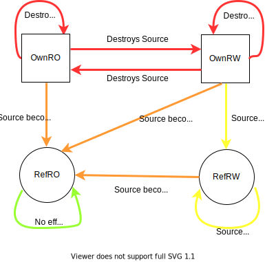

Move and Alias operations in Rust
==================================
TODO: Add Copyable types to this
TODO: Add transition from Owned (RO) to Ref (RW)

The below table lists the possible move and alias operations in Rust

| Operation | Source type | Destination Type | Possible? | Effect on Source | 
| ---------:| -----------:| ----------------:| ---------:| -------------------:|
| Move   | Owned (RO) | Owned (RO) | Yes | Destroyed |
| Move   | Owned (RO) | Owned (RW) | Yes | Destroyed |
| Move   | Owned (RW) | Owned (RW) | Yes | Destroyed |
| Move   | Owned (RW) | Owned (RO) | Yes | Destroyed |
| Alias  | Owned (RO) | Ref (RO)   | Yes | Becomes RO, Non-Movable till Dest exists |
| Alias  | Owned (RW) | Ref (RO)   | Yes | Becomes RO, Non-Movable till Dest exists |
| Alias  | Ref (RO)   | Ref (RO)   | Yes | None    |
| Alias  | Ref (RO)   | Ref (RW)   | No  | N/A     |
| Alias  | Ref (RW)   | Ref (RO)   | Yes | Becomes RO till Dest exists        |
| Alias  | Ref (RW)   | Ref (RW)   | Yes | Becomes unusable till Source exists |

Transition Diagram
==================
