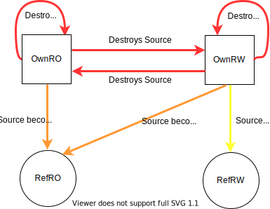

Move and Alias operations in Rust
==================================

The below table lists the possible move and alias operations in Rust

| Assign From | Assign To | Effect on source variable | 
| ---------:| -----------:| ----------------:|
| Read-Only Owner  | Read-Only Owner  | Permanently invalidated |
| Read-Only Owner  | Read-Write Owner | Permanently invalidated |
| Read-Write Owner | Read-Write Owner | Permanently invalidated |
| Read-Write Owner | Read-Only Owner  | Permanently invalidated |
| Read-Only Owner  | Read-Only Ref    | Becomes RO, Non-Movable till Dest can't be expired |
| Read-Write Owner | Read-Write Ref   | Becomes unusable till dest can't be expired        | 
| Read-Write Owner | Read-Only Ref    | Becomes RO, Non-Movable till dest can't be expired | 

Transition Diagram
==================

TODO
=====
- Add Copyable types to this list?